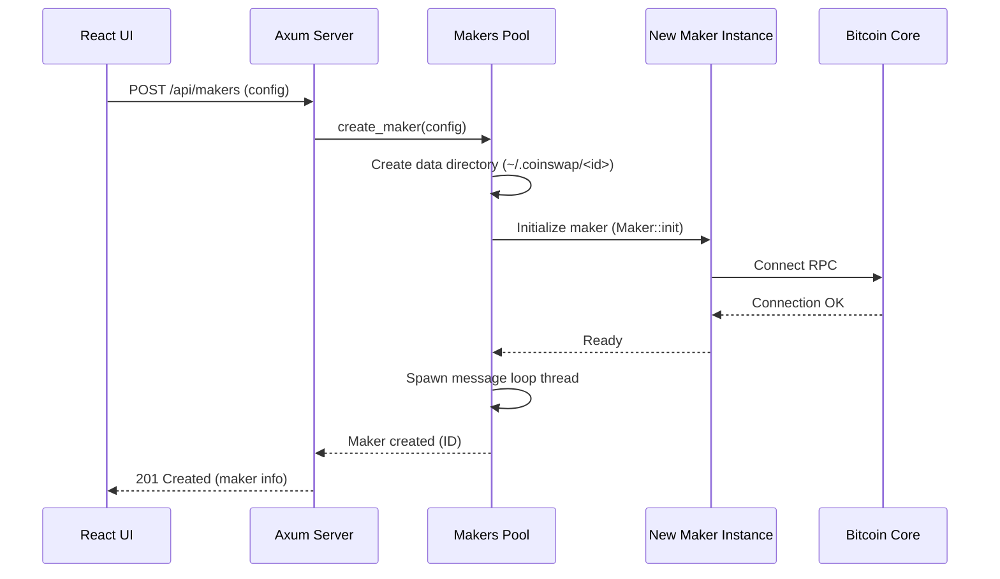

## Introduction

The main goal here is pretty straightforward: we need a web interface where users can manage their Maker servers without having to mess around with command-line tools. Think of it like a control panel where you can see everything that's happening with your makers, manage wallets, check swap status, and basically do everything the maker-cli does but in a nice web UI.

## The Big Picture

There are three main pieces that work together. First, there's the web application that users interact with. Second, there's the "Makers Pool" concept that manages all the individual maker instances. Third, we have the actual Maker processes doing the coinswap work.

Here's how the data flows through the system:


The user opens their browser, loads the React app, and starts clicking around. Every action they take sends an HTTP request to our Tokio-based server. The server then talks to the MakerManager, which owns the Makers Pool. a registry that keeps track of all registered makers. When you create a new maker, the pool initialises it and starts a message loop thread for it. When you start it, a separate server thread runs the coinswap P2P server. When you check status or query the wallet, the request goes through a bidirectional channel into the message loop thread and comes back with the result.

## Technology Stack

### Frontend: React.js

The frontend is a single-page application that talks to the backend purely through REST APIs. It uses React Router for client-side routing, and the built output is served as static files directly from the same Axum process in production.

During development, running `npm run dev` inside `frontend/` starts a Vite dev server that proxies `/api` requests to `localhost:3000`, so you can work on the frontend without rebuilding.

### Backend: Tokio + Axum

The backend is built on Rust with Tokio and Axum. This is a natural fit because the entire maker codebase is already in Rust, so we can call into the coinswap library directly without any IPC or serialisation overhead between processes.

Tokio is the async runtime. Axum sits on top of it and handles routing, parameter extraction, and JSON responses. All API handlers share a single `Arc<Mutex<MakerManager>>` as Axum state. Here is what a typical handler looks like:

```rust
async fn get_maker(
    State(state): State<AppState>,
    Path(id): Path<String>,
) -> (StatusCode, Json<ApiResponse<MakerInfoDetailed>>) {
    let mgr = state.lock().await;
    match mgr.get_maker_info(&id) {
        Some(info) => (StatusCode::OK, Json(ApiResponse::ok(info.into()))),
        None => (StatusCode::NOT_FOUND, Json(ApiResponse::err(...))),
    }
}
```

There is an important constraint here: the coinswap library is synchronous. Each maker runs in its own OS thread. The async Axum layer communicates with those threads through a `bidirectional_channel`, which is a typed request/response channel that bridges the async and sync worlds cleanly.

## Component Architecture

### The Makers Pool

The pool is a manager that keeps track of all maker instances. think of it as a registry combined with a factory. When the dashboard starts up, it loads any previously saved maker configurations from disk and re-initialises each one, but it does NOT start their coinswap servers. Users have to explicitly start each maker.

For each registered maker, the pool maintains two threads. The message loop thread handles wallet queries (balance, UTXOs, addresses, sending funds) and runs as long as the maker is registered. The server thread runs the actual coinswap P2P server and only exists while the maker is in the "started" state.

When a user creates a new maker through the dashboard, here is what happens:



Port allocation is the operator's responsibility. If you are running multiple makers on the same host, you must provide unique `network_port` and `rpc_port` values for each one in the creation request. The pool does not auto-assign ports.

When a maker is deleted, the pool signals the server thread to shut down (via an atomic shutdown flag), joins both threads, and drops the message channel. On the next dashboard restart, that maker will not be re-loaded.

Config updates work with a rollback mechanism. The manager stops the server if it was running, tears down the maker entirely, and re-initialises it with the new config. If re-initialisation fails, the old config is restored and the server is restarted if it was running before.

### The HTTP Server Layer

The Axum server exposes a REST API that the React frontend consumes. Endpoints are organised by domain:

**Maker lifecycle:**
- `GET /api/makers` - List all makers
- `POST /api/makers` - Create a new maker
- `GET /api/makers/count` - Total number of registered makers
- `GET /api/makers/{id}` - Get specific maker details
- `GET /api/makers/{id}/info` - Get detailed maker info including config and state
- `DELETE /api/makers/{id}` - Remove a maker entirely
- `PUT /api/makers/{id}/config` - Update maker configuration (triggers re-init with rollback)
- `POST /api/makers/{id}/start` - Start the coinswap server for a stopped maker
- `POST /api/makers/{id}/stop` - Stop the coinswap server (retains the maker registration)
- `POST /api/makers/{id}/restart` - Stop then start

**Wallet operations:**

- `GET /api/makers/{id}/balance` - Get wallet balances (regular, swap, contract, fidelity, spendable)
- `GET /api/makers/{id}/utxos` - List all UTXOs
- `GET /api/makers/{id}/utxos/swap` - List swap UTXOs
- `GET /api/makers/{id}/utxos/contract` - List contract UTXOs
- `GET /api/makers/{id}/utxos/fidelity` - List fidelity UTXOs
- `POST /api/makers/{id}/send` - Send funds to an address
- `GET /api/makers/{id}/address` - Generate a new wallet address
- `POST /api/makers/{id}/sync` - Trigger a wallet sync

**Fidelity bonds:**

- `GET /api/makers/{id}/fidelity` - List fidelity bonds for a maker

**Monitoring:**

- `GET /api/makers/{id}/status` - Current operational status (alive + server running)
- `GET /api/makers/{id}/swaps` - Active and recent swaps (not yet implemented, returns 501)
- `GET /api/makers/{id}/logs` - Recent log entries (accepts `?lines=N`, default 100)
- `GET /api/makers/{id}/logs/stream` - Real-time log stream via Server-Sent Events
- `GET /api/makers/{id}/tor-address` - Tor onion address of the maker
- `GET /api/makers/{id}/data-dir` - Data directory path

Every endpoint returns the same JSON envelope:

```json
{ "success": true,  "data": <T> }
{ "success": false, "error": "<message>" }
```

Authentication is handled at the network level. By default the server binds to `127.0.0.1` and a middleware rejects any request that did not originate from localhost. Remote access can be enabled with `--allow-remote` / `DASHBOARD_ALLOW_REMOTE=true`, but there is no built-in login system. securing that is the operator's responsibility (e.g. via a reverse proxy with TLS and authentication in front of the dashboard).

Interactive OpenAPI documentation for all endpoints is available at `http://localhost:3000/swagger-ui/` while the server is running.
